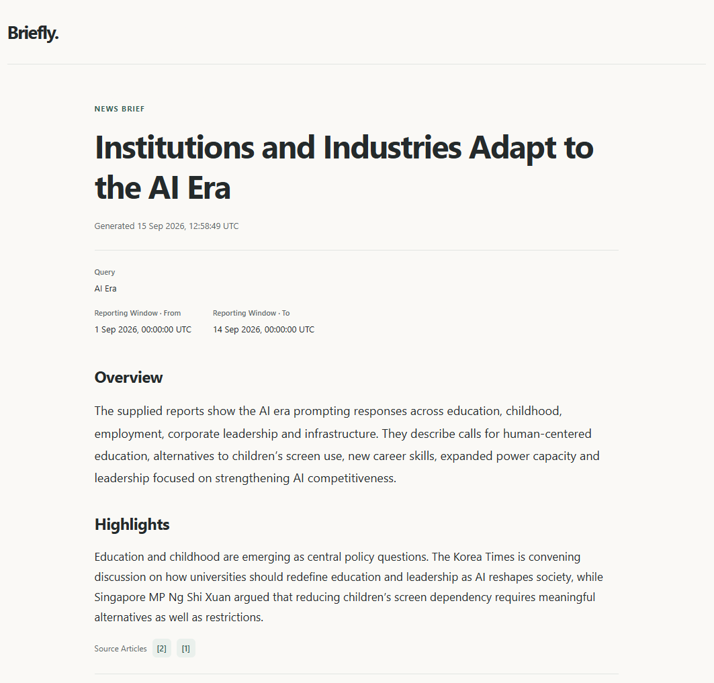
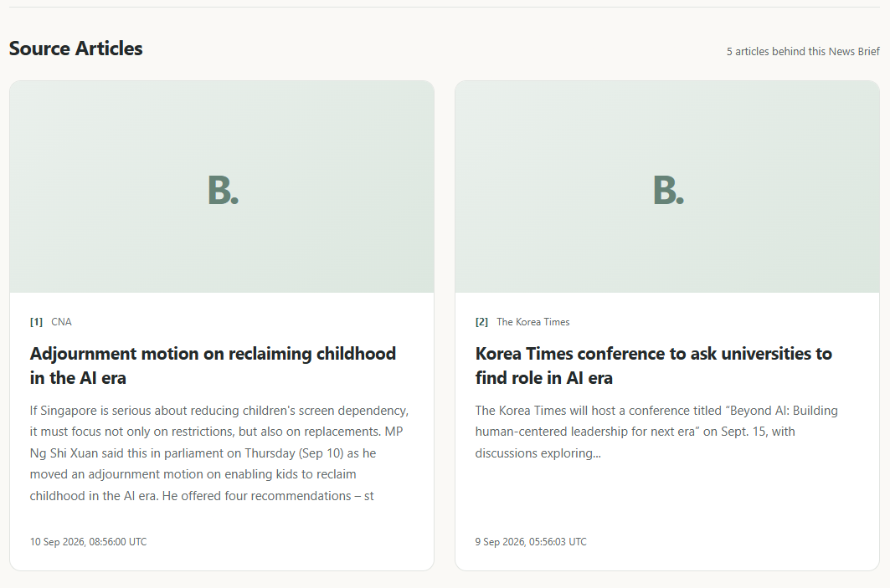

# Briefly

Briefly is a local API that turns recent news into a short News Brief. You send a Query, Briefly
searches GNews for matching English Articles, and an AI model writes a title, an
Overview, and one to five Highlights. Each Highlight lists the Source Articles meant to support it.
Domain terms are defined in [docs/CONTEXT.md](docs/CONTEXT.md).

## Requirements

- JDK 25 (the Maven Wrapper downloads Maven for you)
- A [GNews](https://gnews.io) API key
- An API key for OpenAI, Anthropic, or Gemini, or a local Ollama server with a model installed

## Setup

Copy `.env.example` to `.env` and fill in your GNews key and any cloud AI provider keys you want
to make available. For example, to enable Gemini:

```dotenv
GNEWS_API_KEY=your-gnews-key
GEMINI_API_KEY=your-gemini-key
```

The GNews key is required at startup; a cloud AI key is required when its agent runs. Briefly reads
`.env` from the directory you start it in, which is the project root with Maven. It's a Java
properties file, so don't quote values. Environment variables override it.

Select the News Brief generation model in
[`src/main/resources/application.yaml`](src/main/resources/application.yaml):

```yaml
app:
  ai:
    agents:
      brief-generation:
        model: google-genai/gemini-2.5-flash
```

The checked-in selection is `ollama/qwen3.5:4b`, which requires a running local Ollama server
with that model installed. Adding a cloud provider's key makes it available; change the model
property above to use it for News Brief generation.

### AI providers and models

Set `app.ai.agents.brief-generation.model` to `provider/model`, supply the selected provider's key,
and restart.
Briefly splits at the first `/`: the prefix selects the integration, and everything after it is
passed unchanged as the provider's model identifier, including any further slashes. Both parts
must be nonblank, whitespace is rejected, and the model identifier cannot begin with `/`.
You can keep keys for multiple providers configured; unused keys may be left empty.

| Provider | Model prefix | Credential |
|----------|--------------|------------|
| OpenAI | `openai` | `OPENAI_API_KEY` |
| Anthropic | `anthropic` | `ANTHROPIC_API_KEY` |
| Gemini | `google-genai` | `GEMINI_API_KEY` |
| Ollama | `ollama` | None for local Ollama |

For Ollama, start the server and choose an installed model from `ollama list`.
Spring AI supplies the default provider endpoints, including `http://localhost:11434` for Ollama.
Custom endpoints can use Spring's own properties, such as `SPRING_AI_OLLAMA_BASE_URL`,
`SPRING_AI_OPENAI_BASE_URL`, or `SPRING_AI_ANTHROPIC_BASE_URL`.

Leave `spring.ai.model.chat` unset and select the model through
`app.ai.agents.brief-generation.model`. Restart after changing credentials or model configuration.

## Run

```bash
./mvnw spring-boot:run
```

Or build the JAR and run it from the directory that holds `.env`:

```bash
./mvnw -DskipTests package
java -jar target/briefly-0.0.1-SNAPSHOT.jar
```

On Windows, use `.\mvnw.cmd`. Briefly listens on port 8080. Set `SERVER_PORT` to change it.

Briefly rejects malformed agent model references and unsupported providers when an agent is resolved. Missing
AI keys do not prevent startup; selecting such a provider during a News Brief request fails
with an error identifying the agent and unavailable provider. A wrong nonblank key, base URL, or model
may fail during client initialization or on the first request. AI failures are reported as a `502`.

Briefly logs each request's duration, GNews and AI call timings, Article counts, and token usage.
Every API response has an `X-Correlation-ID` header that matches its log lines.

## API

Briefly serves its own API docs while it runs:

- [Swagger UI](http://localhost:8080/swagger-ui.html) describes every field and error, and lets you
  send requests. **Try it out** makes real calls that count against your GNews and AI quotas.
- The OpenAPI spec is at <http://localhost:8080/v3/api-docs>.

| Endpoint                         | Returns                                                      |
|----------------------------------|--------------------------------------------------------------|
| `POST /api/briefs/generate`      | A News Brief as JSON                                         |
| `POST /api/briefs/generate/html` | The same News Brief as an HTML page                          |
| `GET /actuator/health`           | Application status, without calling GNews or the AI provider |

### Generate a News Brief

Both generate endpoints take the same JSON body:

| Field   | Required | Description                                                          |
|---------|----------|----------------------------------------------------------------------|
| `query` | Yes      | The news you want, in plain text. Up to 200 characters.              |
| `from`  | No       | Start of the Reporting Window. Defaults to 24 hours before `to`.     |
| `to`    | No       | End of the Reporting Window. Defaults to the time of the request.    |

Timestamps are UTC, such as `2026-09-14T08:00:00Z`. They can't be in the future, and `from` can't be
after `to`.

```bash
curl -X POST http://localhost:8080/api/briefs/generate \
  -H "Content-Type: application/json" \
  -d '{"query": "European Union artificial intelligence regulation"}'
```

The response echoes the resolved `criteria` and adds a `title`, an `overview` of up to five
paragraphs, up to five `highlights`, and the `sourceArticles` they cite. Shortened:

```json
{
  "criteria": {
    "query": "European Union artificial intelligence regulation",
    "from": "2025-05-01T09:15:30Z",
    "to": "2025-05-02T09:15:30Z"
  },
  "title": "EU moves to tighten AI oversight",
  "overview": "Lawmakers advanced new supervisory duties for high-risk AI systems, while industry groups warned about compliance costs.",
  "highlights": [
    {
      "text": "Parliament backed stricter supervision of high-risk AI systems, adding reporting duties for providers.",
      "citationIds": [1, 2]
    }
  ],
  "sourceArticles": [
    {
      "citationId": 1,
      "title": "Parliament backs stricter AI supervision",
      "description": "Lawmakers approved additional duties for providers of high-risk AI systems.",
      "url": "https://example.com/news/parliament-backs-ai-supervision",
      "publisher": { "name": "Example Times", "url": "https://example.com", "country": "be" },
      "metadata": { "imageUrl": "https://example.com/images/parliament.jpg", "publishedAt": "2025-05-01T18:42:00Z", "sourceLanguage": "en" }
    },
    {
      "citationId": 2,
      "title": "Industry warns over AI compliance deadlines",
      "description": "Trade bodies said the proposed timeline is unworkable for smaller providers.",
      "url": "https://example.org/news/industry-warns-ai-deadlines",
      "publisher": { "name": "Example Business Review", "url": "https://example.org", "country": "ie" },
      "metadata": { "imageUrl": "https://example.org/images/compliance.jpg", "publishedAt": "2025-05-02T06:10:00Z", "sourceLanguage": "en" }
    }
  ],
  "generatedAt": "2025-05-02T09:15:30Z"
}
```

Each number in `citationIds` matches a `citationId` in `sourceArticles`, which holds only the cited
Articles. Citation IDs mean nothing outside the response. `publisher.country` is where the Publisher
is based, not where the news happened.

### Get the News Brief as HTML

```bash
curl -X POST http://localhost:8080/api/briefs/generate/html \
  -H "Content-Type: application/json" \
  -d '{"query": "European Union artificial intelligence regulation"}' \
  -o brief.html
```

Open `brief.html` in a browser. Errors from this endpoint are still JSON.



The page ends with a card for each Source Article:



### Errors

Errors are [Problem Details](https://www.rfc-editor.org/rfc/rfc9457) with a stable `code`:

| Status                     | `code`                            | Cause                                                                       |
|----------------------------|-----------------------------------|-----------------------------------------------------------------------------|
| `400`                      | `INVALID_REQUEST`                 | Invalid JSON or field. `errors` lists each problem.                         |
| `404`, `405`, `406`, `415` | `INVALID_REQUEST`                 | Unknown path, wrong HTTP method, or unsupported `Accept` or `Content-Type`. |
| `422`                      | `INSUFFICIENT_GENERATION_CONTEXT` | GNews found fewer than two Articles.                                        |
| `502`                      | `ARTICLE_SEARCH_FAILED`           | GNews failed, for example on a bad key, quota, or rate limit.               |
| `502`                      | `BRIEF_GENERATION_FAILED`         | The AI call failed or its output was unusable.                              |
| `500`                      | `INTERNAL_ERROR`                  | Unexpected error in Briefly.                                                |

## Limits

Search covers English Articles from any country, and every News Brief is written in English. Each
request makes one GNews search for up to 10 Articles, sorted by relevance. Briefly sends the Query
as typed. GNews treats quotes, `AND`, `OR`, and `NOT` as operators and requires special characters
to be quoted.

Nothing is stored or cached, so repeating a request calls both providers again and can return a
different News Brief. Briefly doesn't rate-limit, track quotas, or retry failed GNews calls. Failed AI calls are retried as often as the selected provider's Spring AI integration retries them by
default; Briefly neither adds retries of its own nor overrides those defaults.

The GNews free plan is for development and testing only, and has these limits:

- Articles appear 12 hours after publication, so the default 24-hour window covers news from 12 to
  24 hours ago.
- Search goes back 30 days.
- Article content is truncated. Briefly doesn't fetch publisher pages, so the model only sees each
  Article's title, description, and excerpt.
- 10 Articles per request, 100 requests per day (reset at 00:00 UTC), and 1 request per second.
  Going over returns `ARTICLE_SEARCH_FAILED`.

Citations show which Source Articles the model meant to support each Highlight. Briefly only checks
that the cited IDs exist and that at least two Articles are cited. It doesn't check that the
Articles say what the Highlight claims, so read them before you rely on a News Brief.
